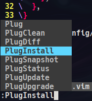

# Neovim
Estas intrucciones te permitiran tener este repositorio funcionando en tu maquina local :)


## Comenzando
Instalar Neovim en tu distrucion linux

```bash
sudo apt install neovim # Debian y derivadas
sudo pacman -S neovim # Arch y derivadas
```

Luego clonar este repositorio, dentro de la carpeta ~/.config
```bash
git clone https://github.com/denis360/nvim.git ~/.config/nvim
```

Luego ingresar con neovim al archivo init.vim
```bash
nvim ~/.config/nvim/init.vim
```

* Instalar los plugins



* Solo espera y con (Space + q) podras salir de neovim

Puedes cambiar la configuracion de guardar, salir y quitar un archivo en la carpeta ./libs/keys.vim
```vim
nnoremap <leader>w :w!<CR>
nnoremap <leader>q :q<CR>
nnoremap <leader>d :bdelete<CR>
``````
